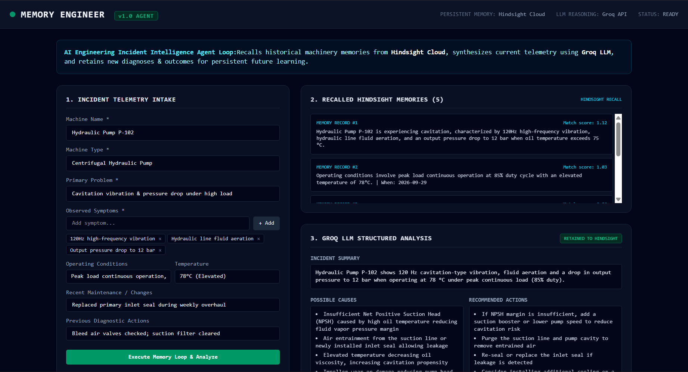

# Memory Engineer — AI Engineering Incident Intelligence Agent

Built for the **AI Agents That Learn Using Hindsight** Hackathon.

**Live demo:** https://memory-engineer.vercel.app/

> The agent doesn't just answer — it remembers every equipment incident it has analyzed and uses that experience on the next one.



## The Problem

In plants and facilities, the same equipment failures come back again and again — a pump cavitates after a seal change, a compressor overheats in summer. The knowledge of *what caused it last time and what fixed it* lives in one engineer's head or in a buried maintenance log. When a different engineer is on shift, the plant starts troubleshooting from zero, and downtime is expensive.

Memory Engineer gives the maintenance team a shared, persistent memory: every incident, diagnosis and repair outcome is retained in **Hindsight**, and every new incident is analyzed **with** that history.

## Proof That It Learns (Two-Incident Test)

| Step | What happens | Result |
| --- | --- | --- |
| Incident 1 — fresh memory bank | Hindsight recall finds nothing; Groq gives a first-principles diagnosis | `RECALLED HINDSIGHT MEMORIES (0)` → incident retained |
| Incident 2 — same pump, different wording | Hindsight recalls Incident 1's symptoms, conditions and diagnosis | `RECALLED HINDSIGHT MEMORIES (5)`, match scores ~1.1 |
| Groq analysis of Incident 2 | Recalled memories are injected into the prompt; the analysis cites them under **Historical Memory Matches** | Context-aware diagnosis instead of a generic one |

Nothing is mocked: the memory count and memory text shown in the UI come directly from the Hindsight recall response.

## How Hindsight Is Used

| Operation | Where | What it does |
| --- | --- | --- |
| `recall(bankId, query, { budget: "mid" })` | `src/services/hindsight.ts` → `recallRelevantIncidentsWithStatus` | Builds a query from the machine name, type, problem, symptoms, conditions, temperature and recent changes; returns the top 5 ranked memories |
| `retain(bankId, content, { context, metadata, timestamp })` | `src/services/hindsight.ts` → `retainIncident` | Stores the incident **plus** Groq's diagnosis, causes and actions, so future recalls return lessons, not just raw symptoms |
| `retain(...)` for outcomes | `src/services/hindsight.ts` → `retainOutcome` / `POST /api/incident-outcome` | Stores what the repair actually did, closing the learning loop |

Reliability details:
- Real status is reported: if Hindsight rejects a call, the UI shows **HINDSIGHT RECALL/RETAIN FAILED** with the real error; the `RETAINED TO HINDSIGHT` badge only appears after Hindsight confirms the write.
- A brand-new bank (before its first retain) is treated as "0 memories", not an error.
- `GET /api/hindsight-health` checks the live connection and runs a probe recall without ever returning the API key.

## Overview

**Memory Engineer** is a persistent full-stack engineering incident intelligence agent for industrial equipment maintenance and systems reliability engineering.

When a complex equipment anomaly occurs, engineers submit observed telemetry and symptoms. Memory Engineer executes a four-stage persistent memory loop:

1. **Intake**: Validates equipment telemetry (`machineName`, `machineType`, `problem`, `symptoms`, `operatingConditions`, `temperature`, `recentChanges`, `previousActions`).
2. **Recall**: Queries **Hindsight Cloud** using `@vectorize-io/hindsight-client` to retrieve relevant historical failure memories, past maintenance records, and previous outcome reports.
3. **Reason**: Passes the incident along with recalled historical memories to **Groq LLM** (`openai/gpt-oss-120b` or configured via `GROQ_MODEL`). Groq analyzes the incident while distinguishing current telemetry from past experiences.
4. **Retain**: Stores the new diagnosis, recommended checks, and post-repair outcomes back into **Hindsight Cloud**, enabling persistent learning for future incidents.

---

## Persistent Memory Pipeline Architecture

```text
[ USER INCIDENT ]
       │
       ▼
[ HINDSIGHT RECALL ]  ──> Queries memory bank for past machine failures
       │
       ▼
[ RECALLED MEMORIES ] ──> Passed as historical context
       │
       ▼
[ GROQ LLM REASONING ] ──> Synthesizes current facts + past memories
       │
       ▼
[ ENGINEERING ANALYSIS ] ──> Summary, Causes, Recommended Actions & Checks
       │
       ▼
[ HINDSIGHT RETAIN ]  ──> Persists new incident diagnosis & post-repair outcomes
```

---

## Tech Stack

Next.js · React · TypeScript · Tailwind CSS · **Hindsight Cloud** (`@vectorize-io/hindsight-client`) · **Groq** (`openai/gpt-oss-120b`) · Vercel

---

## Environment Variables

Configure environment variables in `.env.local` (or server environment settings):

```env
HINDSIGHT_API_KEY=your_hindsight_api_key
HINDSIGHT_BASE_URL=https://api.hindsight.vectorize.io
HINDSIGHT_BANK_ID=engineering-incidents
GROQ_API_KEY=your_groq_api_key
GROQ_MODEL=openai/gpt-oss-120b
```

### Security Directives
* API keys must **NEVER** be exposed to the client or prefixed with `NEXT_PUBLIC_`.
* Server configuration (`src/lib/config.ts`) blocks client-side execution and guards API key safety.

---

## API Endpoints

### 1. `POST /api/incident-analysis`
Executes input validation, Hindsight recall, Groq reasoning, and Hindsight incident retention.

**Example Request:**
```json
{
  "machineName": "Hydraulic Pump P-102",
  "machineType": "Centrifugal Hydraulic Pump",
  "problem": "Cavitation vibration & pressure drop",
  "symptoms": ["120Hz vibration", "Fluid aeration", "Pressure drop to 12 bar"],
  "operatingConditions": "Peak load continuous operation",
  "temperature": "78°C",
  "recentChanges": "Replaced primary inlet seal",
  "previousActions": "Bleed air valves checked"
}
```

### 2. `GET /api/hindsight-health`
Safe diagnostic: reports whether the Hindsight key is present (never its value), the bank ID in use, and a probe recall count. Optional `?q=` runs your own recall query.

### 3. `POST /api/incident-outcome`
Retains post-repair resolution outcomes to Hindsight Cloud.

**Example Request:**
```json
{
  "machineName": "Hydraulic Pump P-102",
  "diagnosis": "Suction line filter restriction causing cavitation",
  "recommendedAction": "Replace suction line filter mesh",
  "actualOutcome": "Replaced filter mesh; vibration eliminated and pressure restored to 24 bar.",
  "success": true
}
```

---

## Local Development & Testing

1. Install dependencies:
```bash
npm install
```

2. Run unit & integration tests:
```bash
npm test
```

3. Run linter and typecheck:
```bash
npm run lint
```

4. Run local development server:
```bash
npm run dev
```

5. Build for production:
```bash
npm run build
```
